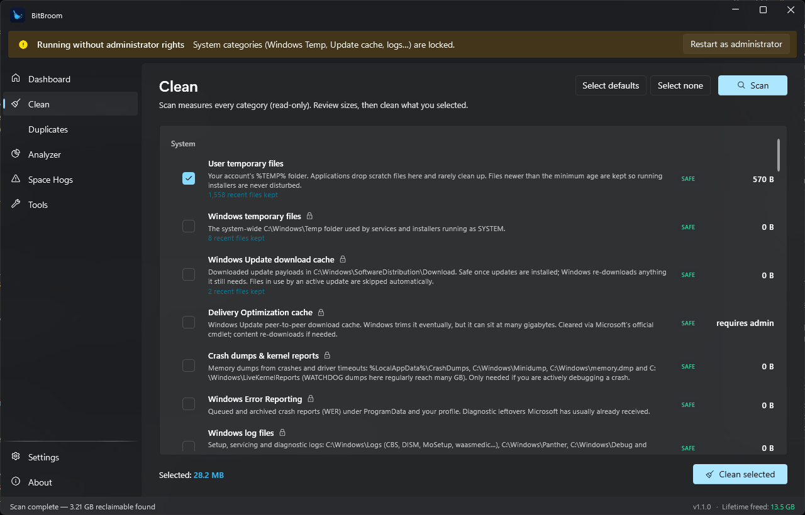
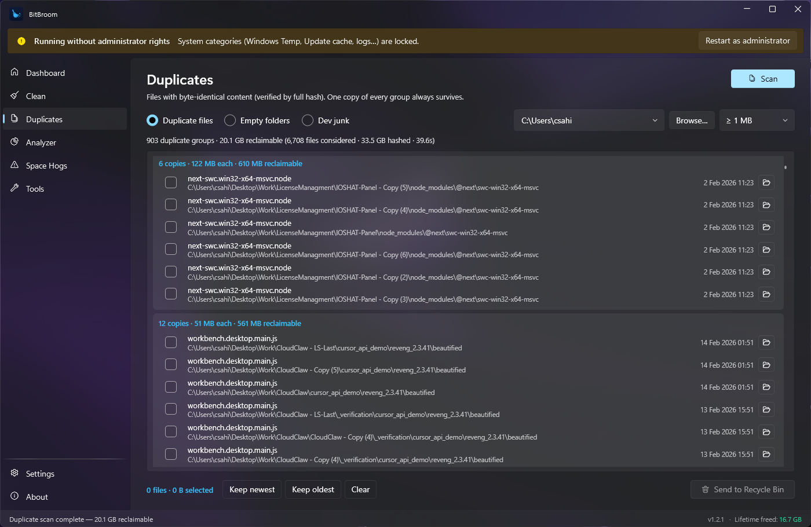
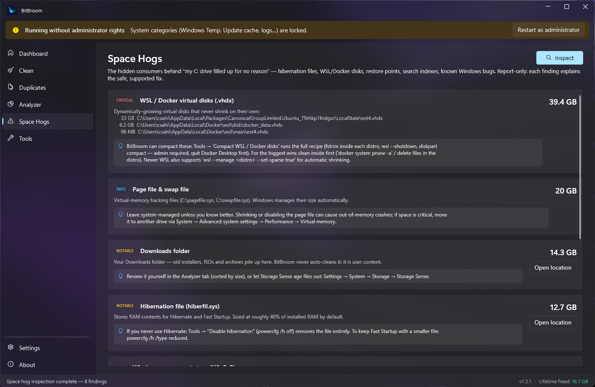
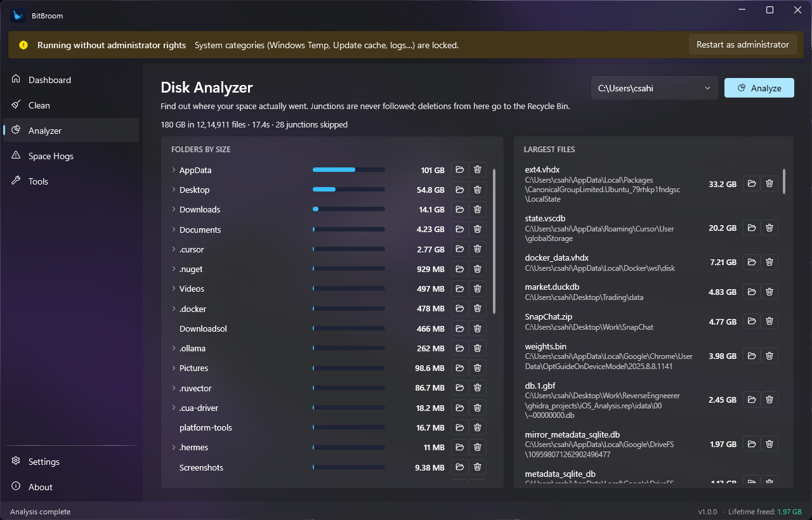

<div align="center">


# BitBroom

**A safety-first, open-source disk cleaner for Windows.**

Reclaim gigabytes of hidden junk — without the fear, the ads, the upsells, or the registry-cleaner snake oil.

**[bitbroom.app/cleaner](https://bitbroom.app/cleaner/)**

[](.github/workflows/ci.yml)
[](LICENSE)
[](https://dotnet.microsoft.com/)
[](#requirements)
[](https://bitbroom.app/cleaner/)



</div>

---

## Why BitBroom exists

Every Windows user eventually hits the same wall: **the C: drive fills up and nobody knows why.**
The usual suspects hide in places Explorer won't show you — shader caches, crash dumps,
update leftovers, WSL virtual disks that never shrink, Electron apps hoarding gigabytes,
a search index gone feral, or (in 2026) a literal Windows bug growing a log file to 500 GB.

The tools that promise to fix this have become part of the problem: ads, telemetry,
subscription nags, fake "registry optimization", and cleaning logic reckless enough to
earn CVEs. BitBroom is the opposite bet: **a cleaner you can read the source of, that
treats your data like it's radioactive, and that tells you the truth.**

## What it does

| | |
|---|---|
| **Clean** | 60 research-backed categories: Windows temp & update caches, crash dumps & kernel reports, Windows Error Reporting, Defender logs, thumbnail caches, browser caches (Chrome/Edge/Brave/Firefox/Opera/Vivaldi), Discord/Slack/Teams/Zoom/Spotify/Adobe/OBS caches, Apple device updates (IPSW), NVIDIA/AMD/Intel shader caches, Steam/Epic/EA/Battle.net/Ubisoft caches, Unity/Unreal engine caches, npm/pip/uv/NuGet/cargo/Go/Gradle/Maven dev caches, OneDrive/Docker logs — plus your own **custom folders** with per-folder age limits. |
| **Duplicates** | Content-verified duplicate finder (size → head hash → full SHA-256, so it never lies about a match), an empty-folder finder, and a **Dev junk** mode that finds regenerable build folders (`node_modules`, `target`, `.venv`, `dist`, `.next`, …) — only when they sit next to a real project manifest, and never inside installed apps (Electron/Squirrel/AppData runtime locations are refused). Recycle Bin-only deletion, and one copy of every duplicate group always survives — enforced in the engine, not just the UI. |
| **Disk Analyzer** | "Where did my space go?" — parallel folder-size treeview, the 100 largest files, a by-file-type breakdown, CSV export, and open-in-Explorer / recycle actions. |
| **Space Hogs** | Report-only detector for the big hidden consumers: `hiberfil.sys`, page files, WSL/Docker `.vhdx` disks, System Restore usage, the Windows Search index, the WinSxS component store, DriverStore, Windows Installer cache, oversized Outlook OSTs, the Downloads folder, the `CapabilityAccessManager.db-wal` Windows bug — each with the safe, supported fix explained. |
| **Tools** | One-click supported maintenance: DISM component-store cleanup & analysis, **WSL/Docker virtual-disk compaction** (reclaims the empty space `.vhdx` files never give back — non-destructive, works on every Windows edition), **OneDrive "free up space"** (bulk online-only, nothing deleted), **old-driver removal** (keeps the newest of every driver family; Windows itself refuses in-use packages), hibernation off/reduced/on, DNS flush, Explorer restart, System Restore usage. Official Windows mechanisms only (`diskpart`, `attrib`, `pnputil`, DISM, powercfg), output streamed live. |
| **CLI** | `bitbroom-cli` — scan/clean/hogs/analyze/dupes/devjunk with `--dry-run`, `--json`, exit codes for scripting. |
| **Automation** | Scheduled cleaning of the safe default set via Windows Task Scheduler (Settings → Scheduled cleaning — free, no Pro tier). Per-folder **exclusions** are enforced engine-deep, and an optional **Recycle Bin mode** gives every clean an undo window. |
| **Native look** | Windows 11 Fluent design end-to-end: acrylic wallpaper-blur backdrop (taskbar-style), native NavigationView, Fluent controls and title bar via the MIT-licensed [WPF UI](https://github.com/lepoco/wpfui) library — plus a branded startup animation, page transitions, staggered reveals, shimmer progress and inertial smooth scrolling. |

<div align="center">



</div>

## The safety model (the actual point)

Read [docs/SAFETY.md](docs/SAFETY.md) for the full design. The short version:

1. **A central `PathGuard` validates every deletion twice** — once when a rule resolves, once
   immediately before each file is deleted. Rules are anchored to known bases (`%LocalAppData%`,
   `%WinDir%`, …) and can never escape them; drive roots, `System32`, `WinSxS`, Program Files,
   your profile, Documents, Desktop, Pictures, Downloads, and OneDrive folders are rejected
   *structurally*, not by convention.
2. **Junctions and symlinks are never followed** — not while scanning, not while resolving
   wildcards, not while deleting. A junction planted inside a temp folder cannot redirect
   BitBroom anywhere (the exact bug class behind CCleaner's CVE-2025-3025).
3. **Cloud placeholders are never touched.** Deleting a OneDrive Files-On-Demand stub deletes
   the cloud copy — BitBroom refuses files with recall/offline attributes outright.
4. **Fresh files are kept.** Anything modified *or created* in the last 24 h (configurable) is
   skipped in temp categories, so running installers and apps are never disturbed.
5. **Files in use are skipped silently** — never forced, never scheduled for boot-time deletion.
6. **Every deletion is written to a plain-text audit log** with full path and size. There is a
   **simulation mode** that only writes the log and deletes nothing.
7. **No registry cleaner. Ever.** The consensus from Windows internals experts (Mark Russinovich):
   negligible benefit, real risk. Same for prefetch purging — a [myth that makes boots slower](docs/RESEARCH.md#myths-we-refuse-to-implement).
8. **No telemetry, ever.** No tracking, no accounts, no crash reporting. The GUI's only
   network touch is an optional once-per-launch GitHub version check (off = zero network
   requests); updates download only when you click Install and are SHA-256-verified
   against the release manifest before running. The engine and CLI have no network code.
   The cleaning engine has zero third-party dependencies; the GUI's only dependency is the
   MIT-licensed, source-auditable WPF UI library (Fluent controls — no network code).

The safety engine is enforced by a test suite whose flagship test plants a junction inside a
cleaned folder pointing at a canary file — the suite fails if the canary is ever touched.

## Install

**Portable (recommended):** grab `BitBroom-portable-win-x64.zip` from Releases, extract, run
`BitBroom.exe`. Self-contained — no .NET runtime install needed.

**Installer:** `BitBroom-<version>-setup.exe` from Releases.

**Build from source:** see [docs/BUILDING.md](docs/BUILDING.md).

> BitBroom runs fine without administrator rights (per-user categories). System categories
> (Windows Temp, Update cache, logs, dumps) unlock via the in-app **Restart as administrator**
> button. No forced UAC prompt at every launch.

## CLI quick start

```text
bitbroom-cli list                                    # all categories with risk levels
bitbroom-cli scan                                    # measure the safe default set (read-only)
bitbroom-cli clean --dry-run                         # full preview: logs everything, deletes nothing
bitbroom-cli clean --yes                             # clean the default set
bitbroom-cli clean --categories user-temp,nvidia-caches --yes
bitbroom-cli hogs                                    # hidden space-consumer report
bitbroom-cli analyze D:\ --depth 3 --top 50          # folder size breakdown + file types
bitbroom-cli dupes D:\Photos --min-size 5            # content-verified duplicate report
bitbroom-cli scan --json                             # machine-readable everything
```

Full reference: [docs/CLI.md](docs/CLI.md).

## What BitBroom deliberately does NOT do

Documented with sources in [docs/CATEGORIES.md](docs/CATEGORIES.md#deliberately-excluded):

- ❌ Registry cleaning (risk without benefit)
- ❌ Prefetch / ReadyBoot purging (slows your next boots; Windows self-manages it)
- ❌ `C:\Windows\Installer` deletion (breaks uninstall/repair of installed software)
- ❌ Browser cookies/history/passwords (that's your data, not junk)
- ❌ Office Document Cache (can hold unsynced edits)
- ❌ "Free RAM" / "boost gaming" / other placebo buttons
- ❌ DISM `/ResetBase` (permanently removes update rollback — not worth it)
- ❌ Secure-wipe of cleaned files (pointless on SSDs, punishing on any drive)
- ❌ winapp2.ini imports (thousands of unvetted third-party delete rules would bypass the
  tested guard model — every BitBroom category is individually researched and test-gated)
- ❌ Startup managers / uninstallers / driver updaters (Windows Settings does this natively;
  suite-creep is how cleaners become the problem)

## The BitBroom family

- 🧹 **BitBroom** (this repo) — cleans the junk you don't need.
- 🟠 **[BitBroom Rescue](https://github.com/pwnapplehat/BitBroom.Rescue)** — brings back
  the files you do: safety-first data recovery (NTFS/FAT32/exFAT undelete, Recycle Bin,
  shadow copies, signature carving, clone-first imaging for failing drives). The source
  drive is opened read-only, always.

## Project layout

```
src/BitBroom.Core/    engine: PathGuard, walker, SafeDeleter, rules, catalog, analyzer,
                      duplicate/empty-folder finders, hogs, scheduling (zero third-party deps)
src/BitBroom.App/     WPF GUI — Windows 11 Fluent via WPF UI (MIT), acrylic backdrop
src/BitBroom.Cli/     bitbroom-cli
tests/                safety-critical test suite (junction canary & friends)
docs/                 RESEARCH, SAFETY, CATEGORIES, CLI, BUILDING
```

## Requirements

- Windows 10 x64 (1809+) or Windows 11 (x64 / ARM64 builds available)
- No runtime dependencies (self-contained binaries)

## Contributing

PRs welcome — especially new cleaning categories *with sources* and safety-test coverage.
Read [CONTRIBUTING.md](CONTRIBUTING.md) first; category proposals must pass the
`CatalogSanityTests` gate.

## License

[MIT](LICENSE). Research grounded in Microsoft documentation, vendor guidance, and years of
community knowledge (Winapp2.ini, BleachBit) — see [docs/RESEARCH.md](docs/RESEARCH.md) for
the full source list.
